### Opis Strony
Strona internetowa umożliwia użytkownikom dodawanie postów i komentarzy pod postami. Każdy użytkownik może usuwać własne posty i komentarze, a użytkownik z uprawnieniami administratora może usuwać dowolne. Dane konta użytkownika zapisane są w sesji.

### Widoki i funkcjonalność

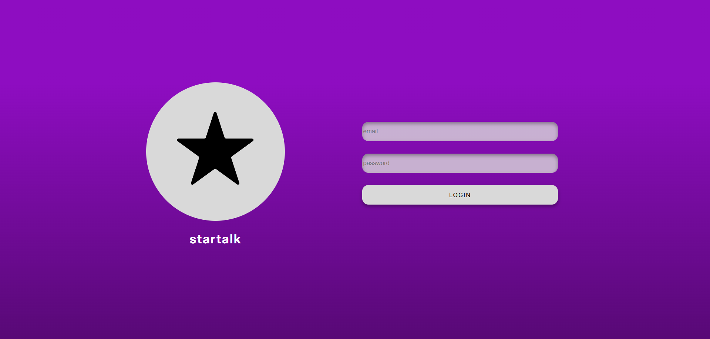
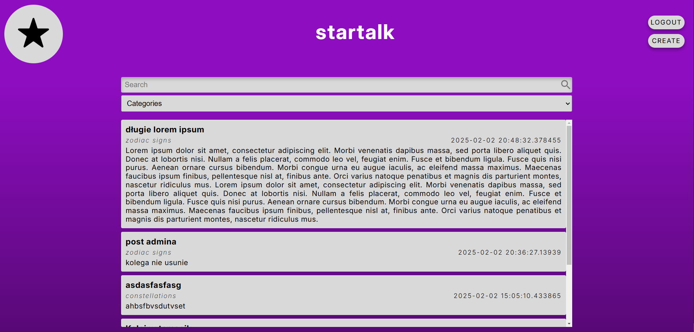

Posty na stronie głównej mogą być filtrowane wg kategorii lub tekstu.

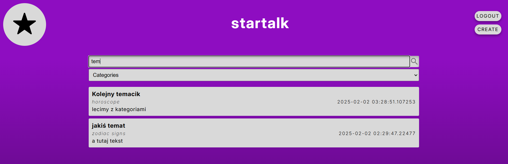
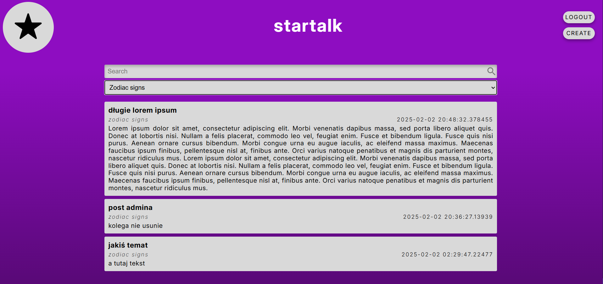

Post z perspektywy admina:

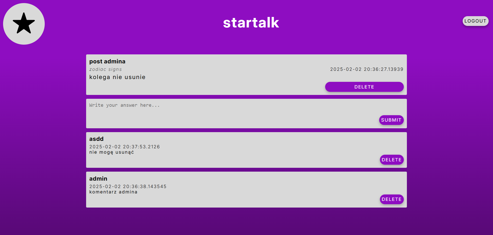

Post z perspektywy zwykłego użytkownika:

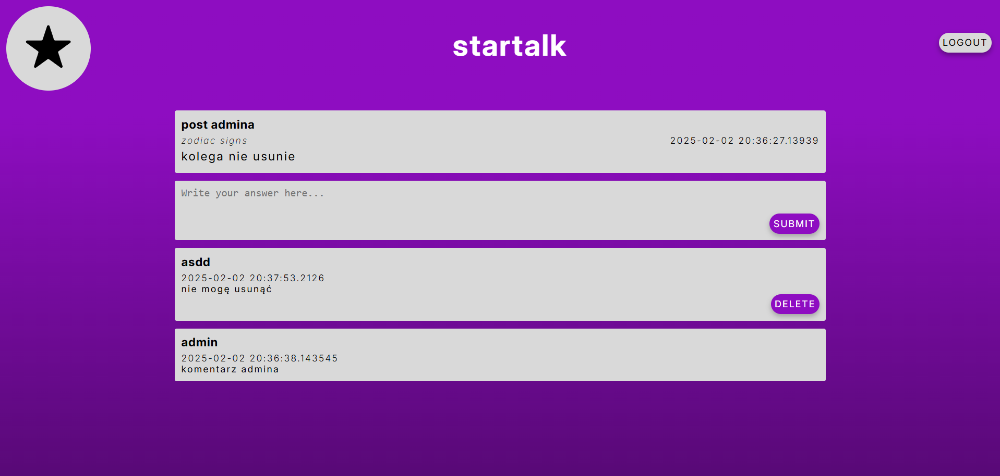

Tworzenie posta:

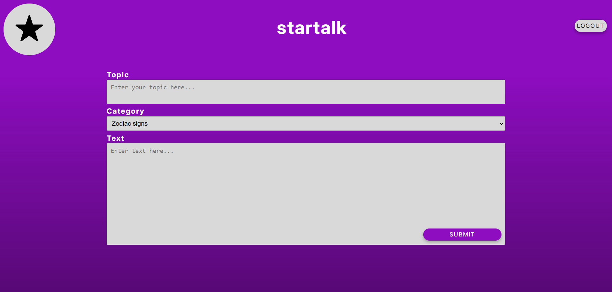

Widok mobilny:

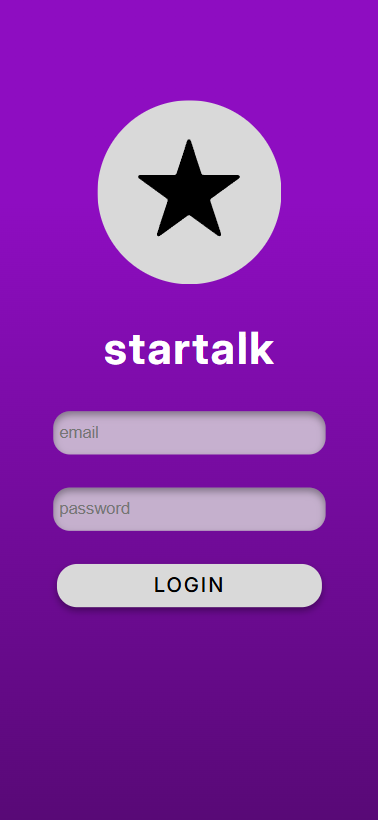
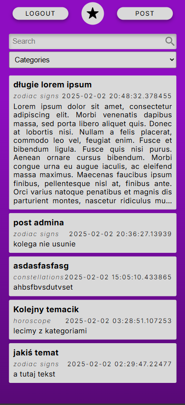
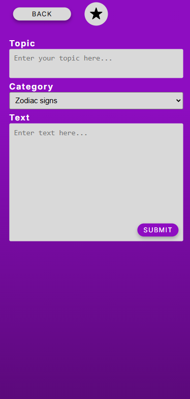
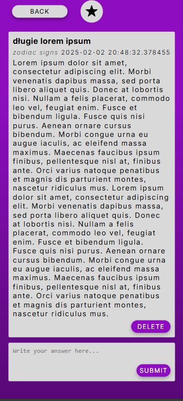

### Struktura Bazy Danych

Diagram relacji:

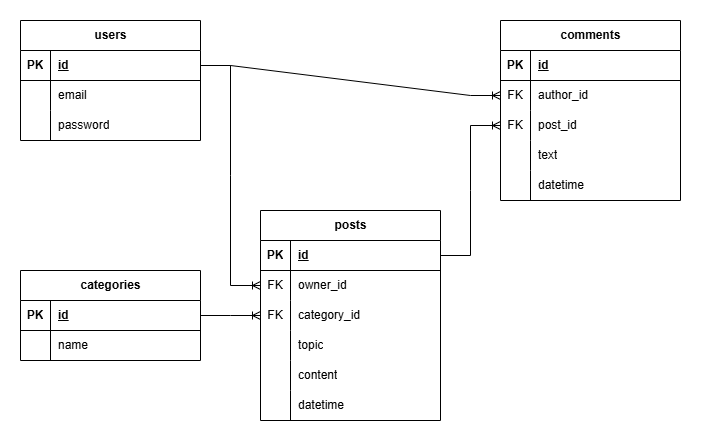

### Instrukcja uruchomienia

W folderze z repozytorium należy wywołać komendy:
```
docker-compose up --build
docker cp db.sql postgres_db:/tmp/db.sql
docker exec -it postgres_db bash
pg_restore -U myuser -d mydatabase /tmp/db.sql
```

Jest to:
1. budowa i uruchomienie kontenera docker
2. skopiowanie do woluminu backupu bazy danych
3. uruchomienie konsoli kontenera
4. przywrócenie bazy danych